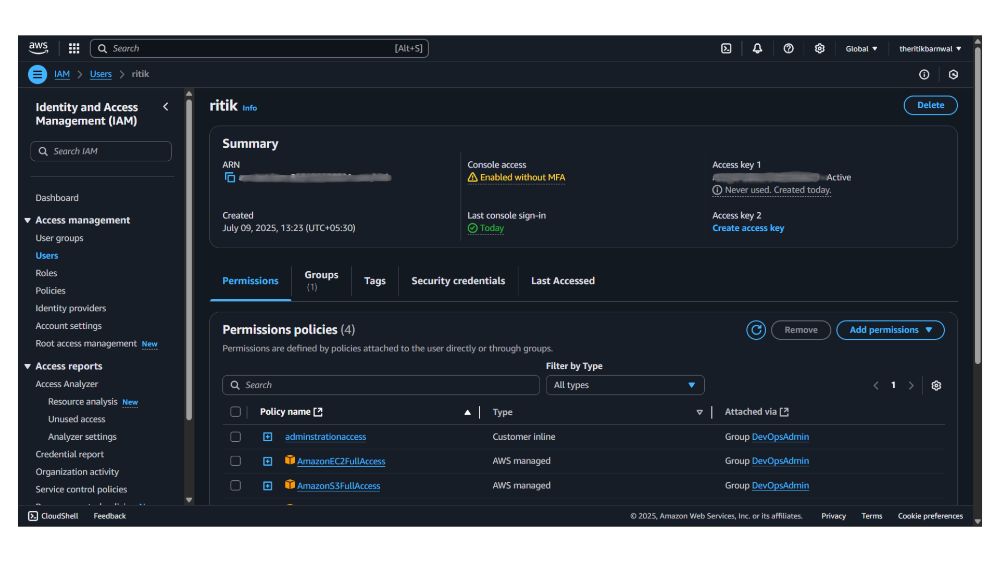

### ✅ Final `README.md` (Markdown file for GitHub)

````markdown
# 🔐 AWS IAM User Creation & Permissions Setup

This repository documents the **first step** of my AWS journey — creating a secure IAM user with the appropriate permissions for AWS CLI and console access.

---

## 📌 Objective

Establish a non-root IAM user for administrative and DevOps tasks, following AWS best practices for security and access control.

---

## 🧾 Summary

- ✅ Created an IAM user: `ritik`
- ✅ Attached necessary permissions via inline and managed policies
- ✅ Configured AWS CLI locally using programmatic access
- ⚠️ MFA not yet enabled (next step for hardening access)

---

## 📁 Steps Performed

### 1. 🔐 Created IAM User

- Username: `ritik`
- Access types:
  - ☑️ Programmatic access (for CLI use)
  - ☑️ AWS Management Console access

---

### 2. 🛡️ Assigned Permissions

IAM user added to group: **`DevOpsAdmin`**  
Attached policies:
- ✅ `AdministratorAccess` (inline policy)
- ✅ `AmazonEC2FullAccess` (AWS managed)
- ✅ `AmazonS3FullAccess` (AWS managed)

> This provides full access to EC2 and S3 services, along with admin capabilities for learning and testing.

---

### 3. ⚙️ AWS CLI Setup

Configured AWS CLI using:

```bash
aws configure
````

Then verified:

```bash
aws sts get-caller-identity
aws iam list-users
```

---

### 🖼️ Screenshot

Below is the screenshot from the IAM console showing the user configuration and permission setup:


